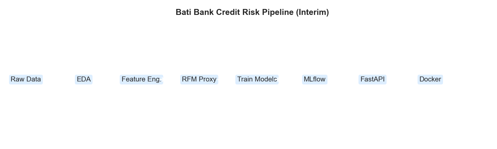
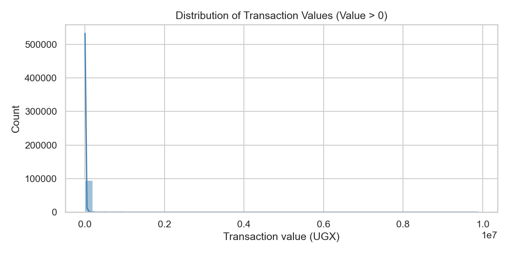
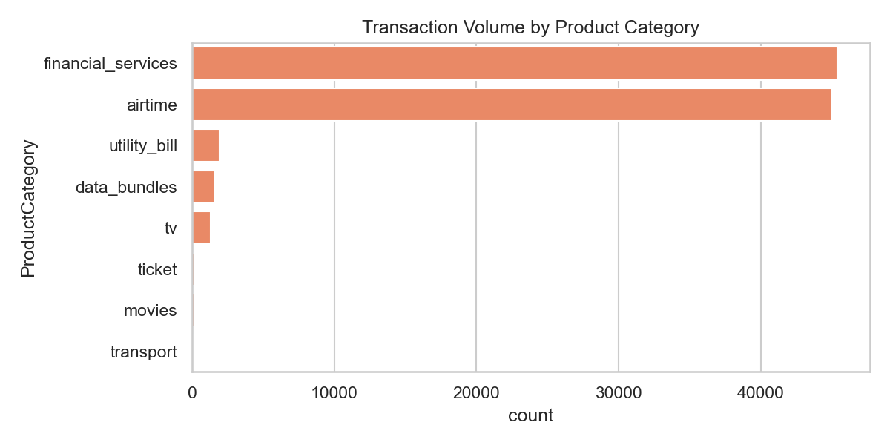
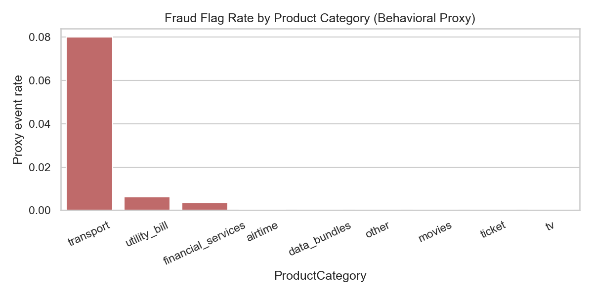
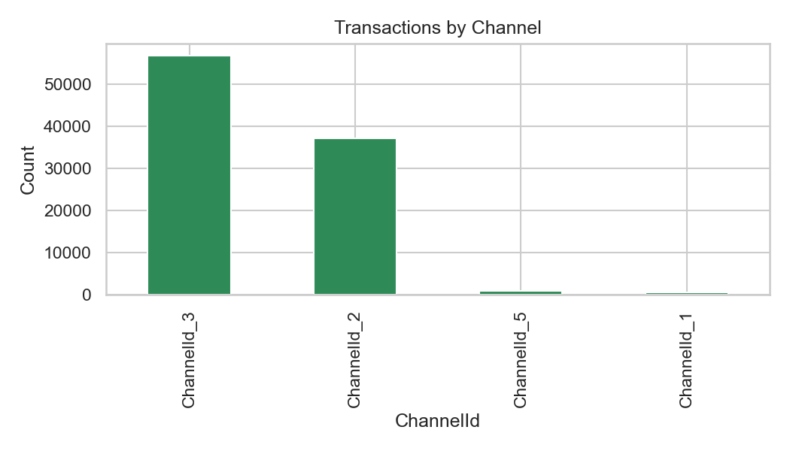
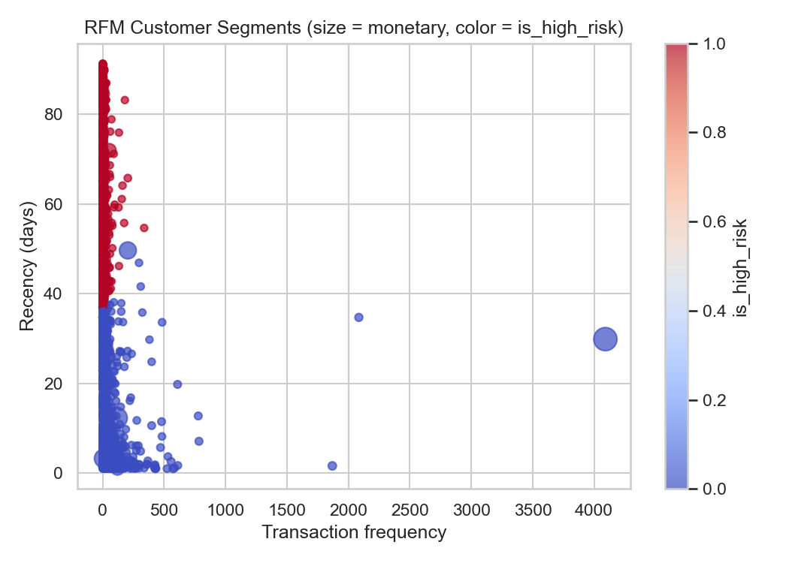

# Interim Report

## Bati Bank Credit Risk Probability Model

I am working on the **Bati Bank Credit Risk Model Challenge**, focusing on transaction-level behavioral data from the Xente platform to estimate customer credit risk when a direct default label is unavailable. The main goal is to build analytical and software engineering competencies through reproducible data pipelines, proxy target engineering, machine learning with MLflow, API deployment, Docker, and continuous integration.

This interim report summarizes progress made so far, methods applied, tools used, challenges encountered, and next steps planned for the final submission.

---

## Task 1: Git & Environment Setup

### Objective

Establish a robust, reproducible, and collaborative environment using GitHub, version control, Python virtual environments, and CI/CD.

### Implementation Steps

- Created GitHub repository [credit-risk-model](https://github.com/mersy11dan/credit-risk-model) with the project root at `credit-risk-model/` (not nested under parent folders).
- Set up Python 3.11+ virtual environment and `requirements.txt` (pandas, scikit-learn, MLflow, FastAPI, pytest, ruff).
- Added `.gitignore` for data, models, MLflow artifacts, notebooks checkpoints, and environment files.
- Organized project structure per challenge specification:

```
credit-risk-model/
├── .github/workflows/ci.yml
├── data/raw/ & data/processed/
├── notebooks/eda.ipynb
├── src/ (data_processing, train, predict, api, woe_iv, results)
├── tests/
├── Dockerfile & docker-compose.yml
└── README.md
```



### Challenges Faced

- Git was initially initialized at the user home directory, causing incorrect nested paths on GitHub; resolved by re-initializing Git inside `credit-risk-model/` only.
- Python 3.13 local environment vs. Python 3.11 in Docker/CI required attention to compatibility.

### Outcome

Environment setup is complete, reproducible, and documented in `README.md`. The repository is ready for collaborative development and automated validation on every push to `main`.

---

## Task 2: Data Profiling, Cleaning & Exploratory Data Analysis (EDA)

### Objective

Profile and explore the Xente transaction dataset to understand data quality, distributions, and risk-related patterns before modeling.

### Implementation Steps

- Loaded **95,662 transactions** across **3,742 customers** from `data/raw/data.csv`.
- Built `notebooks/eda.ipynb` and reusable helpers in `src/eda.py` (missingness, numeric/categorical summaries, group summaries).
- Confirmed **no missing values** in raw transaction columns.
- Identified **heavy-tailed** monetary features (`Amount`, `Value`) and strong correlation (~0.99) between them.
- Observed **highly imbalanced** fraud proxy (`FraudResult`): ~0.2% of transactions flagged.
- Analyzed patterns by product category, channel, and pricing strategy.









### Key EDA Insights

1. Fraud/proxy events are rare; PR-AUC and stratified sampling are important for modeling.
2. Monetary features require scaling or log transforms due to extreme outliers.
3. Customer activity is skewed (median ~7 transactions vs. mean ~26 per customer).
4. Transport and certain channels show higher proxy event rates than airtime.

### Challenges Faced

- Large dataset size required efficient pandas operations and optional sampling during development.
- Interpreting `FraudResult` as a behavioral proxy vs. true credit default required clear business documentation.

### Outcome

EDA is complete with documented insights in the notebook and README. The dataset is well understood and ready for customer-level feature engineering.

---

## Task 3: Feature Engineering & Proxy Target (RFM Clustering)

### Objective

Build customer-level features and create a supervised proxy target (`is_high_risk`) when no direct default label exists.

### Implementation Steps

- Implemented modular pipeline in `src/data_processing.py`:
  - Customer aggregates: total/avg/count/std transaction amounts
  - Time features: hour, day, month, year from `TransactionStartTime`
  - Categorical modes (e.g. `mode_ProductCategory`)
- Built **RFM metrics** (Recency, Frequency, Monetary) per `CustomerId`.
- Standardized RFM features and applied **K-Means (k=3, random_state=42)**.
- Labeled the **least engaged cluster** as `is_high_risk = 1`.
- Documented proxy assumptions in README (modeling assumption, not ground truth).
- Added **WoE/IV helpers** in `src/woe_iv.py` for scorecard-style variable analysis.



### Challenges Faced

- Selecting the high-risk cluster required a transparent ranking rule (recency ↑, frequency ↓, monetary ↓).
- Aligning API request schema with customer-level features trained by the sklearn pipeline.

### Outcome

Processed modeling dataset can be saved to `data/processed/modeling_dataset.csv`. Proxy target pipeline is tested and reproducible (`tests/test_proxy_target_rfm.py`).

---

## Task 4: Model Training & Experiment Tracking

### Objective

Train and compare multiple classifiers with hyperparameter tuning and MLflow experiment logging.

### Implementation Steps

- Implemented `src/train.py` with:
  - **Logistic Regression**, **Decision Tree**, **Random Forest**, **Gradient Boosting**
  - `RandomizedSearchCV` (ROC-AUC scoring)
  - Metrics: accuracy, precision, recall, F1, ROC-AUC
- MLflow logging for parameters, metrics, and model artifacts per run.
- Best model saved to `models/model.pkl`; comparison outputs in `models/model_comparison.csv` and `model_comparison.md` via `src/results.py`.

### Challenges Faced

- Class imbalance required `class_weight='balanced'` and stratified train/test splits.
- MLflow file-store URI formatting on Windows required `Path.as_uri()` for reliable tracking.

### Outcome

Training pipeline is modular, testable, and production-oriented. Model comparison summaries are report-ready for the final submission.

---

## Task 5: FastAPI Inference Service & Docker Deployment

### Objective

Deploy the trained model as a REST API with validation and containerized deployment.

### Implementation Steps

- Built FastAPI app in `src/api/main.py` with `/health` and `/predict`.
- Pydantic models in `src/api/pydantic_models.py` for request/response validation.
- Model loading from MLflow registry or local `models/model.pkl` (`src/api/model_loader.py`).
- Response includes `risk_probability` and `risk_category` (Low/Medium/High).
- **Dockerfile** and **docker-compose.yml** with health checks and volume mounts for models/MLflow.

### Challenges Faced

- Ensuring API starts gracefully when model artifact is not yet mounted (503 on `/predict`, health still returns OK).
- Matching inference feature columns to training pipeline output.

### Outcome

API and Docker setup are deployment-ready. Service runs on port 8000 via `uvicorn` or `docker compose up --build`.

---

## Task 6: Testing & Continuous Integration (CI)

### Objective

Maintain code quality with automated linting and unit tests on every push to `main`.

### Implementation Steps

- Wrote **42+ unit tests** across data processing, EDA, WoE/IV, training, API, and model loader.
- Configured `.github/workflows/ci.yml`:
  - `ruff check` and `ruff format --check`
  - `pytest tests/ -v`
- Fail build on any lint or test failure.

### Outcome

CI is simple, reliable, and aligned with production engineering standards.

---

## Next Steps

- Complete full model training on the processed dataset and finalize model comparison table in the report.
- Validate proxy target against alternative labels (e.g. `FraudResult`) and document trade-offs.
- Add SHAP or coefficient analysis for interpretability (Basel II alignment).
- Peer-test FastAPI and Docker deployment.
- Prepare final PDF report with executive summary, methodology, visuals, and recommendations for Bati Bank stakeholders.

---

## Conclusion

This interim phase established a complete foundation for Bati Bank’s credit risk modeling challenge: reproducible codebase, thorough EDA, transparent proxy target engineering, ML training with MLflow, deployable API, Docker support, and CI/CD. Challenges around Git structure, class imbalance, and proxy interpretation were addressed through documentation and modular design. The project is on track for final model selection, validation, and stakeholder reporting.

---

## Working Hours

| Task | Description | Hours |
|------|-------------|-------|
| Task 1 | Git & Environment Setup | 8 hrs |
| Task 2 | Data Profiling & EDA | 14 hrs |
| Task 3 | Feature Engineering & RFM Proxy | 12 hrs |
| Task 4 | Model Training & MLflow | 10 hrs |
| Task 5 | FastAPI & Docker | 8 hrs |
| Task 6 | Testing & CI/CD | 6 hrs |
| **Total (interim)** | | **58 hrs** |

---

**Prepared by:** Mihret Daniel  
**Date:** June 1, 2026  
**Program:** 10 Academy – Bati Bank Credit Risk Model Challenge
