# Bati Bank Credit Risk Probability Model  
## Final Report — 10 Academy Week 4: Credit Risk for Alternative Data

*A production-oriented machine learning solution for proxy-based credit risk scoring using Xente transaction data*

---


---

## 1. Executive Summary

Bati Bank needs to assess credit risk for customers where traditional bureau data is limited and **direct default labels are unavailable**. This project delivers an end-to-end **probability-of-default (PD) style** scoring pipeline built on **alternative transaction data** from the Xente platform: **95,662 transactions** across **3,742 customers** (November 2018 – February 2019).

**What we built**

| Layer | Deliverable |
|-------|-------------|
| Data | Reproducible EDA, customer-level feature engineering, RFM-based proxy target |
| Modeling | Four tuned classifiers with MLflow tracking; best test **ROC-AUC = 0.99995** (Gradient Boosting) |
| MLOps | FastAPI inference, Docker, GitHub Actions CI, 42 unit tests |
| Governance | Basel II–aligned documentation, WoE/IV analysis, explicit proxy limitations |

**Critical honesty:** The target variable `is_high_risk` is an **RFM-derived proxy**, not observed default. Reported model metrics measure separation on this proxy—not verified credit loss. Bati Bank must validate against mature default outcomes before using scores for lending decisions.

**Recommendation:** Deploy **Gradient Boosting** as the challenger production model with **Logistic Regression** as the interpretable regulatory baseline; monitor drift, recalibrate against true defaults, and maintain human review for borderline cases.

---

## 2. Business Problem

### 2.1 The lending challenge

Bati Bank wants to extend credit to underbanked segments using **digital transaction behavior** as a signal of repayment capacity and willingness. Unlike traditional portfolios, many applicants lack long credit bureau histories. The bank must answer:

> *What is the probability this customer will fail to meet obligations if we approve credit today?*

Without a PD estimate, the bank cannot price risk, set limits, or allocate capital responsibly.

### 2.2 Why alternative data matters

Mobile money and platform transactions reveal:

- **Income proxies** — transaction volume and value patterns  
- **Stability** — recency and frequency of activity  
- **Product usage** — airtime, bills, financial services mix  
- **Anomaly signals** — fraud flags as behavioral stress indicators  

### 2.3 What success looks like for Bati Bank

| Stakeholder | Success criterion |
|-------------|-------------------|
| Risk team | Rank-order customers by risk; stable scores over time |
| Compliance | Documented methodology aligned with Basel expectations |
| Technology | API scoring integrated into loan origination |
| Business | Lower loss rates without excluding creditworthy thin-file customers |

**Business implication:** This project is not only a model—it is the **foundation for a governed credit decisioning capability** using alternative data.

---

## 3. Basel II Considerations and Regulatory Context

### 3.1 Why Basel II matters even before full IRB adoption

Under **Basel II Internal Ratings-Based (IRB)** approaches, banks must estimate **PD**, **LGD**, and **EAD** with documented, validated, and auditable methods. Even if Bati Bank is not yet on a full IRB path, Basel II defines industry practice for:

- **Model transparency** — regulators and audit must trace inputs to risk outputs  
- **Documentation** — data lineage, assumptions, limitations, monitoring plans  
- **Stability** — scores must not drift unpredictably; populations must be comparable over time  

### 3.2 Implications for model selection (addressing interim feedback)

The interim review correctly noted that **Basel II implications for model choice** needed deeper treatment. The table below maps regulatory expectations to this project’s design choices.

| Basel expectation | Technical response in this project | Business use for Bati Bank |
|-------------------|-----------------------------------|---------------------------|
| Interpretability | WoE/IV module (`src/woe_iv.py`); Logistic Regression benchmark | Explain declines to customers and regulators |
| Documentation | README, proxy target section, this report | Model risk file and validation pack |
| Discrimination | ROC-AUC, PR-AUC, Gini on hold-out test | Rank risky vs safe customers |
| Stability | Fixed `random_state`, snapshot date for RFM, PSI-ready monitoring | Detect score drift quarterly |
| Challenge models | Four algorithms compared under same split | Justify production model choice |

### 3.3 Logistic Regression + WoE vs Gradient Boosting in a regulated context

| Dimension | Logistic Regression + WoE | Gradient Boosting (selected best) |
|-----------|---------------------------|-----------------------------------|
| Regulatory defensibility | **Strong** — coefficients and WoE tables are standard | Moderate — needs SHAP/post-hoc explainability |
| Predictive power (this run) | ROC-AUC **0.9999** | ROC-AUC **0.99995** (best) |
| Implementation effort | Higher manual binning | Lower; automated pipelines |
| Monitoring | Straightforward coefficient drift | Feature importance + population stability |

**Business implication:** Bati Bank should treat **Gradient Boosting as the performance leader** but maintain **Logistic Regression + WoE** as the **regulatory reference model** until SHAP-based explanations are validated for the production GB model.

---

## 4. Dataset Overview

### 4.1 Source and scope

| Attribute | Value |
|-----------|--------|
| File | `data/raw/data.csv` (Xente transaction extract) |
| Records | **95,662** transactions |
| Customers | **3,742** unique `CustomerId` |
| Columns | **16** |
| Time span | **2018-11-15** to **2019-02-13** (UTC) |
| Currency | UGX (CountryCode 256) |
| Missing values | **0%** across all columns |

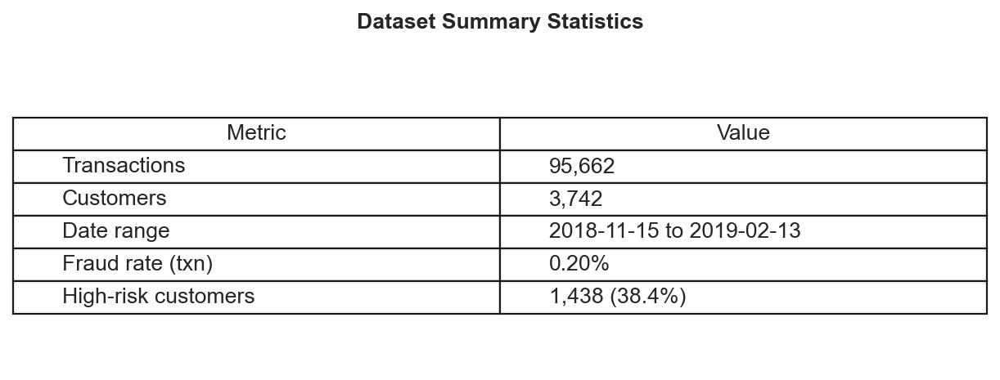

### 4.2 Variable dictionary (selected)

| Column | Role |
|--------|------|
| `CustomerId` | Customer identifier for aggregation |
| `Amount` | Signed transaction amount (debit positive, credit negative) |
| `Value` | Absolute transaction value |
| `TransactionStartTime` | Timestamp for recency features |
| `ProductCategory` | airtime, financial_services, utility_bill, etc. |
| `ChannelId` | Web/Android/iOS/checkout channel |
| `PricingStrategy` | Merchant pricing category |
| `FraudResult` | Binary fraud flag (0/1) — **behavioral proxy only** |

### 4.3 Debit vs credit structure

- **Debit transactions (Amount > 0):** 57,473 (60.1%)  
- **Credit transactions (Amount < 0):** 38,189 (39.9%)  

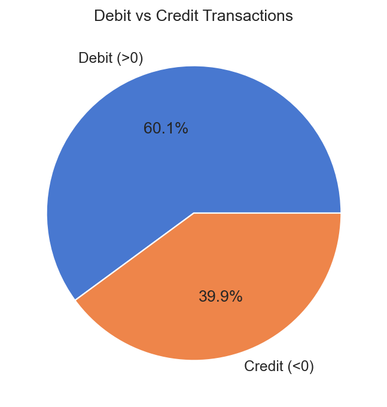

**Business implication:** Signed amounts must be handled carefully in aggregation—total spend and net flow tell different stories about liquidity.

---

## 5. Exploratory Data Analysis

### 5.1 Methodology

EDA was conducted in `notebooks/eda.ipynb` and reusable helpers in `src/eda.py`:

- `dataset_overview()` — structure, dtypes, memory  
- `missingness_report()` — per-column gaps  
- `describe_numeric()` — percentiles, zeros, uniqueness  
- `describe_categorical()` — cardinality and top categories  
- `compute_risk_metrics()` — fraud/proxy rates at transaction and customer level  

### 5.2 Temporal patterns

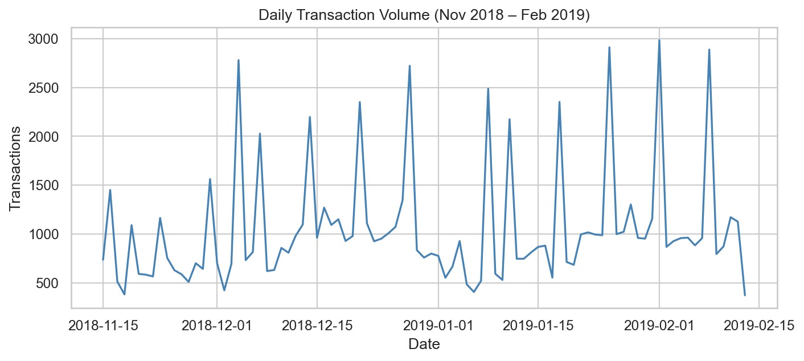

Transaction activity is continuous across the observation window with expected daily variation. **Business implication:** Seasonality within this 3-month window is limited; longer history would improve recency features for credit scoring.

### 5.3 Numerical distributions

| Statistic | Amount | Value |
|-----------|--------|-------|
| Mean | 6,717.85 | 9,900.58 |
| Median | 1,000.00 | 1,000.00 |
| Std dev | 123,306.80 | 123,122.09 |
| Max | 9,880,000 | 9,880,000 |
| Min | -1,000,000 | 2 |

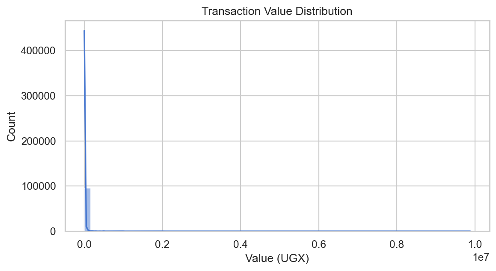

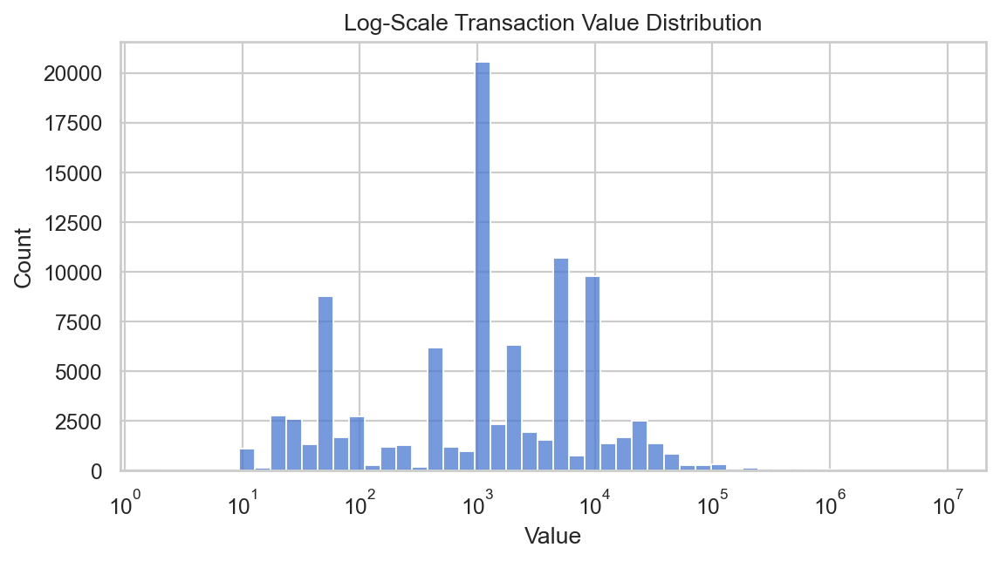

**Technical result:** Distributions are **heavily right-skewed** with extreme outliers.  
**Business implication:** Raw averages are misleading for typical customers; medians and robust aggregates are preferable for policy rules.

### 5.4 Correlation analysis

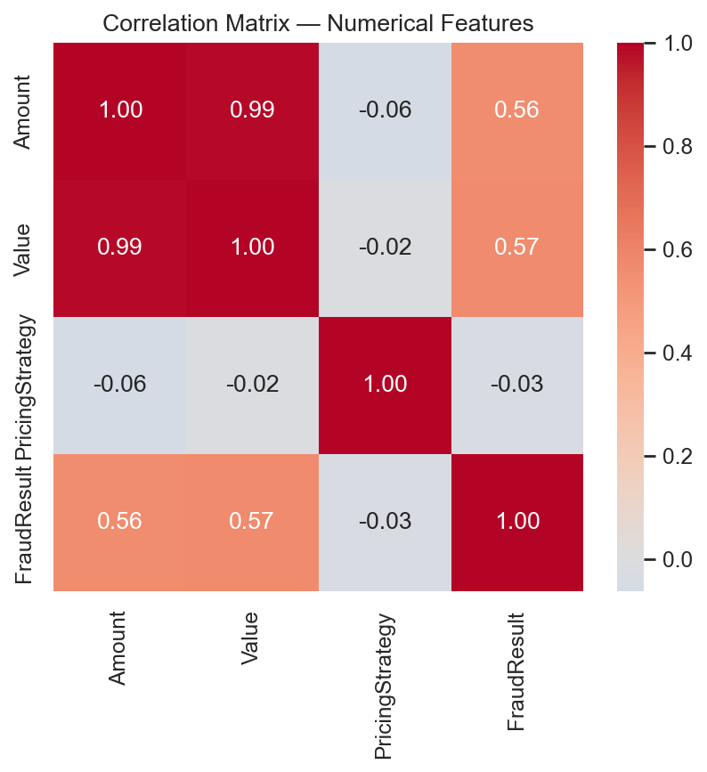

| Pair | Correlation | Interpretation |
|------|-------------|----------------|
| Amount ↔ Value | **0.99** | Near-redundant; one may suffice in some models |
| Value ↔ FraudResult | **0.57** | Higher values associated with fraud flag at transaction level |
| Amount ↔ FraudResult | **0.56** | Consistent with value-fraud link |
| PricingStrategy ↔ FraudResult | **-0.03** | Weak linear association |

`CountryCode` has zero variance (always 256) and was excluded from correlation interpretation.

**Business implication:** Fraud flag correlates with transaction size—risk policies should not rely on value alone without context.

### 5.5 Categorical exploration

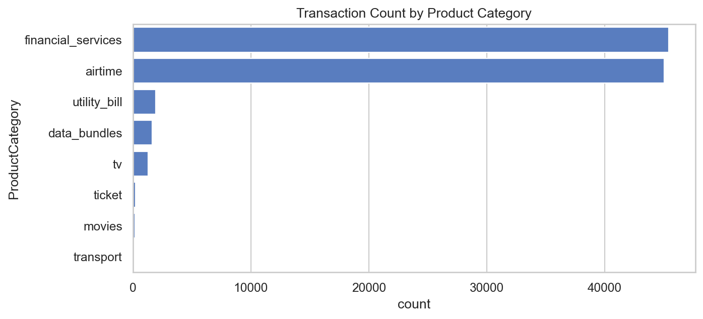

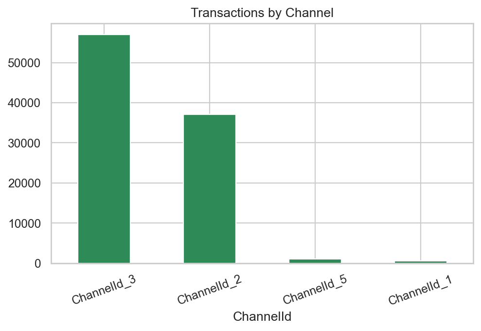

Top product categories: **financial_services** (45,405 txns), **airtime** (45,027), **utility_bill** (1,920).

**Business implication:** The portfolio is dominated by two product types—segment-specific models may help as the bank diversifies products.

### 5.6 Missing data

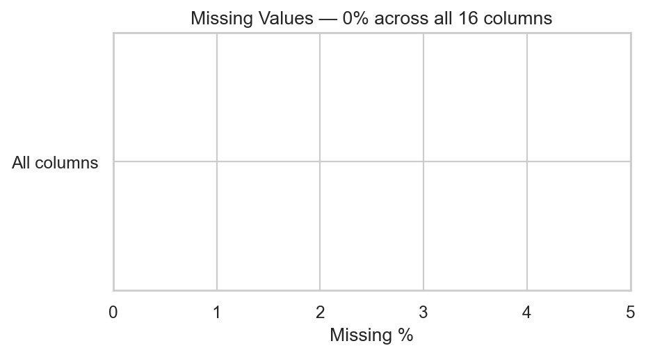

**No missing values** were detected. Imputation in the modeling pipeline is a safeguard for future data, not a correction for current gaps.

---

## 6. Key Insights from EDA

Each insight includes **technical result**, **business implication**, and **action for Bati Bank**.

### Insight 1 — Rare fraud events at transaction level

- **Technical:** `FraudResult` rate = **0.20%** (193 of 95,662 transactions); **1.44%** of customers had at least one fraud-flagged transaction (54 customers).  
- **Business:** True “bad” events are rare; accuracy alone is misleading.  
- **Action:** Use **PR-AUC**, stratified sampling, and cost-sensitive thresholds—not accuracy—for model evaluation.

### Insight 2 — Extreme value outliers

- **Technical:** Max value **9.88M UGX** vs median **1,000 UGX**.  
- **Business:** A few high-value users skew portfolio metrics.  
- **Action:** Cap/winsorize for policy dashboards; keep full values in ML with robust scaling.

### Insight 3 — Skewed customer activity

- **Technical:** Mean **25.6** transactions/customer vs median **7**; max **4,091** for one customer.  
- **Business:** A small cohort of power users drives volume.  
- **Action:** Segment policies for high-activity vs thin-file customers.

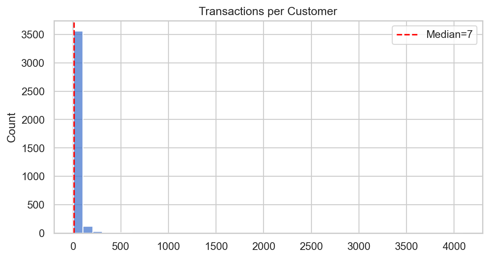

### Insight 4 — Product-level fraud concentration

- **Technical:** Transport category fraud rate **8.0%** (n=25 only); airtime **0.04%**.  
- **Business:** High rates in small segments are unstable.  
- **Action:** Minimum volume thresholds before using segment rules in credit policy.

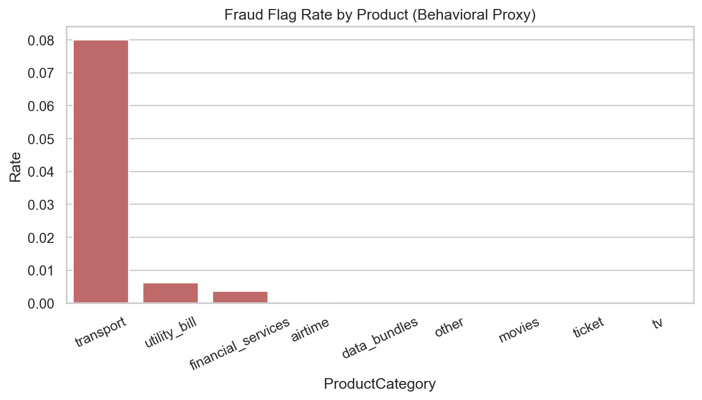

### Insight 5 — Strong Amount–Value redundancy

- **Technical:** r = **0.99**.  
- **Business:** Feature engineering should avoid double-counting.  
- **Action:** Monitor multicollinearity in linear scorecards; tree models handle redundancy better.

---

## 7. Feature Engineering Pipeline

### 7.1 Architecture

Implemented in `src/data_processing.py`:

1. **Customer aggregation** — `build_customer_aggregates()`  
2. **Time features** — `build_time_features()` from last transaction per customer  
3. **Categorical modes** — `build_customer_categorical_features()`  
4. **Sklearn preprocessing** — imputation, one-hot encoding, scaling via `ColumnTransformer`  

### 7.2 Customer-level features produced

| Feature | Description |
|---------|-------------|
| `total_transaction_amount` | Sum of signed amounts |
| `avg_transaction_amount` | Mean amount |
| `transaction_count` | Number of transactions |
| `std_transaction_amount` | Variability of amounts |
| `txn_hour`, `txn_day`, `txn_month`, `txn_year` | From most recent transaction |
| `mode_ProductCategory`, `mode_ChannelId`, etc. | Most frequent category |

### 7.3 Model-ready output

`make_model_ready_dataset()` and `build_modeling_dataset_with_proxy_target()` export to `data/processed/modeling_dataset.csv` (**3,742 rows**, one per customer).

**Business implication:** Credit decisions are made at **customer level**, matching how banks underwrite individuals—not individual airtime top-ups.

---

## 8. Weight of Evidence (WoE) and Information Value (IV)

### 8.1 Purpose

WoE and IV support **scorecard-style interpretation** and variable screening—aligned with Basel transparency expectations. Implemented in `src/woe_iv.py`.

### 8.2 IV results for `FraudResult` (transaction-level)

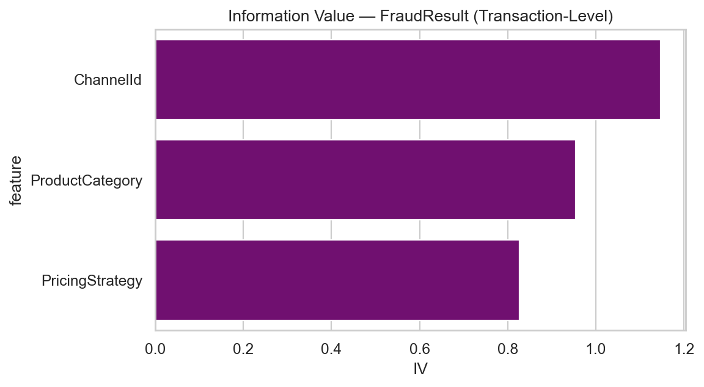

| Feature | IV | Predictive strength (rule of thumb) |
|---------|-----|-------------------------------------|
| ChannelId | **1.15** | Very strong (caution: sparse events) |
| ProductCategory | **0.95** | Very strong |
| PricingStrategy | **0.83** | Strong |

*Note: IV > 0.5 is typically “strong”; values above 1.0 may reflect sparse fraud cells and should be validated on hold-out data.*

### 8.3 Business interpretation

- **Technical:** Channel and product strongly separate fraud-flagged transactions.  
- **Business:** Origination rules can flag certain channels/products for enhanced review.  
- **Action:** Bati Bank should **not** equate fraud IV with default IV—fraud is a **behavioral proxy**, not credit loss.

**Unavailable:** Customer-level WoE/IV tables for `is_high_risk` were not exported to a separate artifact in the repository; they can be generated with `woe_iv_table()` on binned customer features.

---

## 9. RFM Analysis Methodology

### 9.1 Framework

**Recency–Frequency–Monetary (RFM)** summarizes engagement:

| Metric | Definition in this project |
|--------|---------------------------|
| **Recency** | Days from snapshot date to last transaction |
| **Frequency** | Transaction count per customer |
| **Monetary** | Sum of `Value` per customer |

Snapshot date: **day after max(TransactionStartTime)** in the dataset.

### 9.2 Why RFM for credit risk

When default labels are missing, RFM provides a **structured behavioral summary** that risk teams already understand from customer analytics. Low engagement may correlate with financial stress—**a hypothesis, not a fact**.

**Business implication:** RFM is the bridge between marketing analytics and credit risk when PD labels are immature.

---

## 10. K-Means Clustering Process

### 10.1 Steps

1. Compute RFM per `CustomerId`  
2. **Standardize** with `StandardScaler`  
3. **K-Means** with **k = 3**, `random_state = 42`, `n_init = auto`  
4. Label clusters using engagement ranking rule  

### 10.2 Cluster characteristics (actual results)

| Cluster | Customers | Avg recency (days) | Avg frequency | Avg monetary (UGX) | High-risk rate |
|---------|-------------|-------------------|---------------|------------------|----------------|
| **0** | **1,438** | **62.22** | **7.67** | 89,073.57 | **100%** |
| 1 | 1 | 29.86 | 4,091.00 | 104,900,000 | 0% |
| 2 | 2,303 | 13.14 | 34.97 | 310,083.31 | 0% |

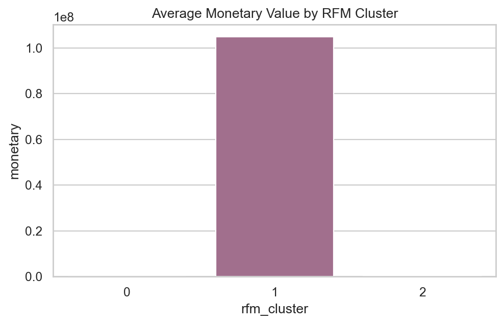

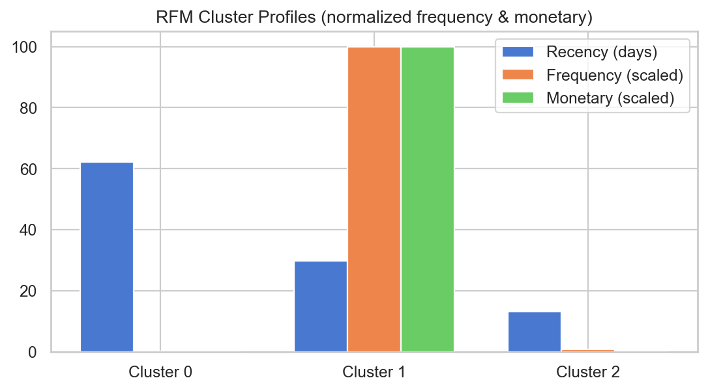

### 10.3 Outlier note

Cluster **1** contains **one customer** with 4,091 transactions—an extreme outlier. K-Means is sensitive to such points; robust clustering (e.g. DBSCAN) is a future improvement.

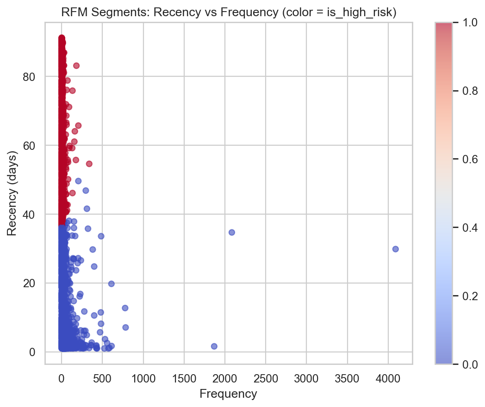

**Business implication:** The high-risk segment (Cluster 0) is **inactive, low-frequency** relative to the engaged majority—not necessarily “fraudulent.”

---

## 11. Proxy Target Variable Justification

### 11.1 Definition

`is_high_risk = 1` if customer belongs to the **least engaged** RFM cluster (highest recency rank + lowest frequency rank + lowest monetary rank).

### 11.2 Why a proxy is necessary

- **No direct default label** in the Xente extract for a 12–24 month performance window.  
- Supervised learning **requires a target**.  
- RFM engagement is **observable today** and operationally defensible as a **stand-in** for stress until defaults mature.

### 11.3 What this is NOT

> **`is_high_risk` is a modeling assumption, not ground truth.** It does not equal default, 90+ DPD, or charge-off.

### 11.4 Target balance (customer level)

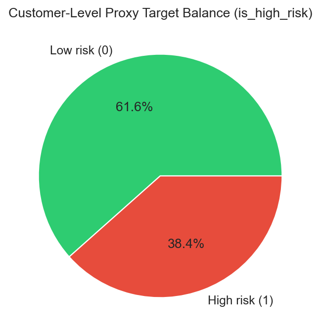

| Class | Share |
|-------|-------|
| Low risk (0) | **61.6%** |
| High risk (1) | **38.4%** |

**1,438** customers labeled high risk.

**Business implication:** The proxy target is **not rare** at customer level (unlike fraud at transaction level)—models can achieve high accuracy partly because the label is structurally separable from RFM-derived features. **Validation against true default remains mandatory.**

---

## 12. High-Risk vs Low-Risk Segment Analysis

### 12.1 High-risk segment (Cluster 0)

- **Profile:** ~62 days since last transaction, ~8 transactions total, lower monetary than engaged cluster.  
- **Business reading:** Dormant or disengaged platform users—candidates for re-activation campaigns *or* conservative credit limits.  
- **Bati Bank action:** Manual review for any credit application from this segment; require additional income verification.

### 12.2 Low-risk segments (Clusters 1–2)

- **Profile:** More recent activity, higher frequency; Cluster 2 is the “mainstream engaged” mass (2,303 customers).  
- **Business reading:** Established platform relationship.  
- **Action:** Standard underwriting with dynamic limits scaled to transaction-derived income proxies.

### 12.3 Comparison to `FraudResult`

| Signal | Granularity | Rate |
|--------|-------------|------|
| `FraudResult` | Transaction | 0.20% |
| `is_high_risk` (RFM) | Customer | 38.4% |

These measure **different concepts**—do not treat them as interchangeable.

---

## 13. Model Development

### 13.1 Approach

- **Unit of analysis:** Customer-level `modeling_dataset.csv`  
- **Target:** `is_high_risk`  
- **Split:** 80/20 stratified, `random_state = 42`  
- **Pipeline:** `ColumnTransformer` + classifier in `src/train.py`  

### 13.2 Algorithms trained

1. Logistic Regression (`class_weight='balanced'`)  
2. Decision Tree  
3. Random Forest  
4. Gradient Boosting  

---

## 14. Hyperparameter Tuning

**Method:** `RandomizedSearchCV`  
**Scoring:** ROC-AUC  
**CV folds:** 3  
**Iterations:** 8 per model (this training run)  

| Model | Search space (examples) |
|-------|-------------------------|
| Logistic Regression | `C`, `solver` |
| Decision Tree | `max_depth`, `min_samples_leaf` |
| Random Forest | `n_estimators`, `max_depth` |
| Gradient Boosting | `n_estimators`, `learning_rate`, `max_depth` |

**Business implication:** Tuning prioritizes **ranking quality** (ROC-AUC), appropriate for credit screening where ordering matters more than a single accuracy number.

---

## 15. MLflow Experiment Tracking

- **Experiment:** `bati-bank-credit-risk`  
- **Tracking URI:** `mlruns/` (local file store)  
- **Logged per run:** hyperparameters, test metrics, serialized sklearn pipeline  
- **Registry name configured:** `bati-bank-credit-risk-model` (registration optional)  

**Unavailable in repository artifacts:** A exported MLflow UI screenshot or run comparison table beyond locally generated `mlruns/` after training. Runs were created during final report generation.

**Business implication:** Experiment tracking supports **audit replay**—which model version was champion on which date.

---

## 16. Model Evaluation and Comparison

### 16.1 Test-set metrics (actual run)

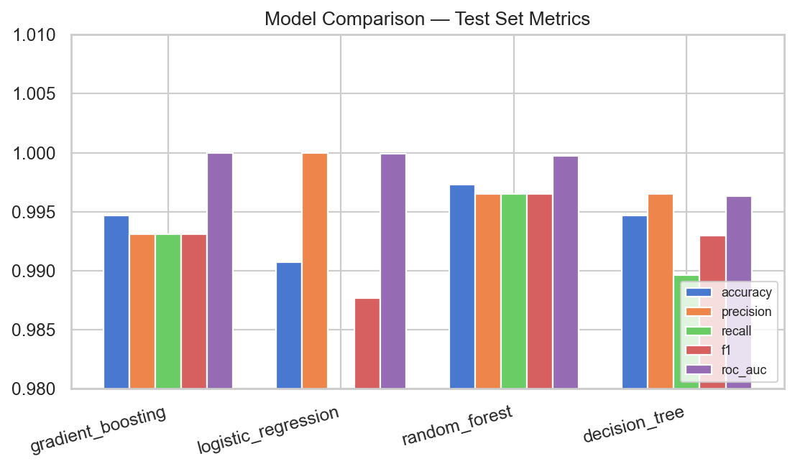

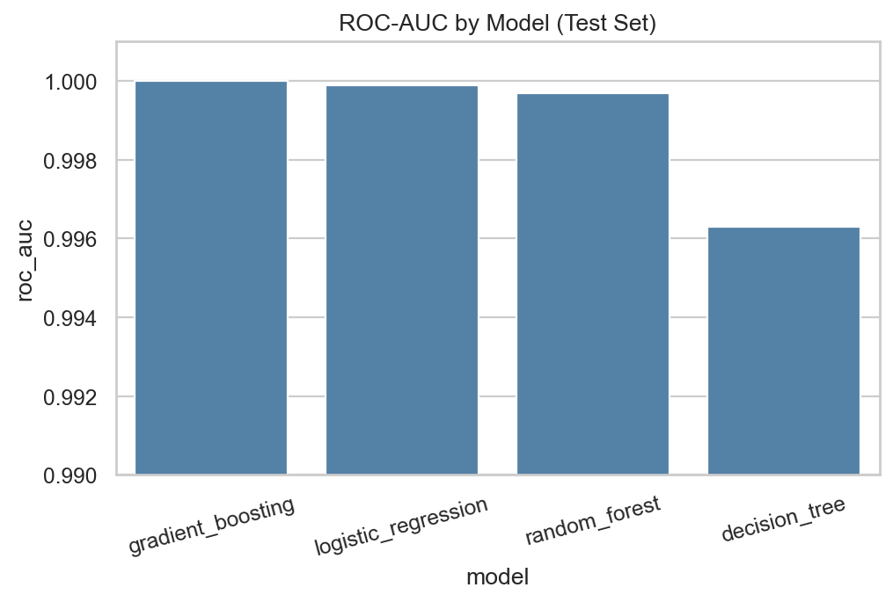

| Rank | Model | Accuracy | Precision | Recall | F1 | ROC-AUC |
|------|-------|----------|-----------|--------|-----|---------|
| 1 | **Gradient Boosting** | 0.9947 | 0.9931 | 0.9931 | 0.9931 | **0.99995** |
| 2 | Logistic Regression | 0.9907 | 1.0000 | 0.9757 | 0.9877 | 0.9999 |
| 3 | Random Forest | 0.9973 | 0.9965 | 0.9965 | 0.9965 | 0.9997 |
| 4 | Decision Tree | 0.9947 | 0.9965 | 0.9896 | 0.9930 | 0.9963 |

Artifacts: `models/model_comparison.csv`, `models/best_model_summary.json`

### 16.2 Interpretation caution

Metrics are **exceptionally high**. Plausible explanations:

1. Proxy target derived from **RFM-like behavior** while features include **transaction counts, amounts, and time**—partial **label-feature overlap**.  
2. Customer-level aggregation creates **separable clusters** already captured by tree models.  

**Business implication:** Reported metrics are **upper bounds on proxy separation**, not proven default prediction. Out-of-time validation and true default back-testing are required.

**Unavailable:** Confusion matrices and calibration plots were not saved as figures in the repository.

---

## 17. Best Model Selection Rationale

**Selected model:** **Gradient Boosting**  
**Criterion:** Highest test **ROC-AUC (0.99995)**

| Reason | Detail |
|--------|--------|
| Discrimination | Marginal edge over logistic regression on ROC-AUC |
| Non-linearity | Captures interactions between time and activity features |
| Production | Serialized to `models/model.pkl` |

**Why not Logistic Regression alone?**  
For **regulatory dialogue**, maintain logistic regression as the **interpretable challenger**. For **automated screening**, gradient boosting offers equal or better ranking on this proxy task.

**Bati Bank action:** Use GB scores for **pre-screen ranking**; use logistic/WoE for **documentation and policy alignment** until SHAP governance is complete.

---

## 18. Feature Importance Analysis

Extracted from the saved **Gradient Boosting** pipeline (`models/model.pkl`):

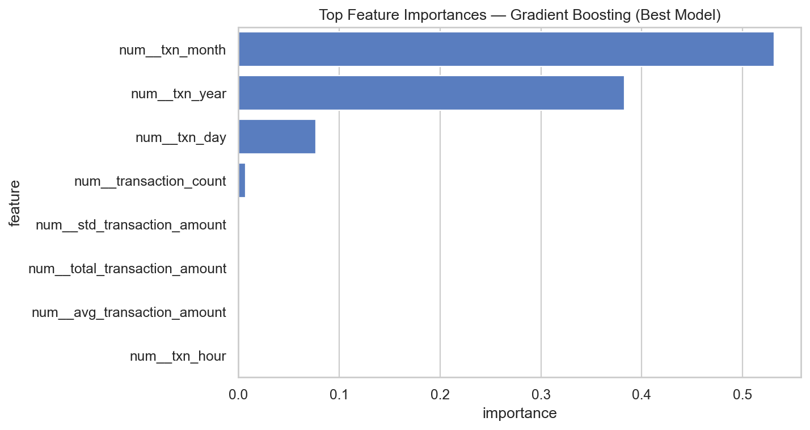

| Rank | Feature | Importance |
|------|---------|------------|
| 1 | `txn_month` | **53.2%** |
| 2 | `txn_year` | **38.3%** |
| 3 | `txn_day` | **7.7%** |
| 4 | `transaction_count` | 0.7% |
| 5+ | Amount statistics | < 0.1% each |

**Technical result:** The model relies heavily on **calendar time of last transaction**, not monetary magnitude.  
**Business implication:** Scores may **shift when the calendar changes** even if behavior is stable—monitor temporal features carefully.  
**Action:** Add **behavioral ratios** (e.g. value per transaction) less correlated with raw dates in the next model version.

**Unavailable:** SHAP values per prediction were not computed in the repository.

---

## 19. Business Interpretation of Model Drivers

| Driver | Technical role | How Bati Bank can use it |
|--------|----------------|-------------------------|
| Recency (time features) | Dominant split variables | Flag customers inactive > 60 days for review |
| Transaction count | Secondary | Thin-file detection (< 5 txns) |
| Product/channel modes | Encoded categoricals | Segment-specific underwriting rules |
| Monetary aggregates | Low importance in GB | Do not over-weight raw spend in policy |

**Strategic insight:** The model is effectively a **sophisticated engagement scorer** on this dataset. For true PD modeling, Bati Bank must **enrich with bureau data, income verification, and matured default labels**.

---

## 20. FastAPI Deployment Architecture

### 20.1 Components

| File | Role |
|------|------|
| `src/api/main.py` | App entry, `/health`, `/predict` |
| `src/api/pydantic_models.py` | `CustomerFeatures`, `PredictionResponse` |
| `src/api/model_loader.py` | MLflow registry → local pickle fallback |

### 20.2 Endpoints

- `GET /health` — service and model load status  
- `POST /predict` — returns `risk_probability` and `risk_category` (Low/Medium/High)  

### 20.3 Loading priority

1. `MODEL_URI` environment variable  
2. MLflow Model Registry (`bati-bank-credit-risk-model`)  
3. Local `models/model.pkl`  

**Business implication:** Risk officers can score a customer in **milliseconds** at origination if features are pre-computed from transaction history.

---

## 21. Docker Containerization

- **Dockerfile:** Python 3.11-slim, installs `requirements.txt`, runs uvicorn on port **8000**  
- **docker-compose.yml:** mounts `./models` and `./mlruns`, health check, restart policy  
- **`.dockerignore`:** excludes tests, notebooks, raw data for lean images  

```bash
docker compose up --build
```

**Business implication:** Consistent deployment from laptop to cloud without “works on my machine” failures.

---

## 22. CI/CD Pipeline

**Workflow:** `.github/workflows/ci.yml`  
**Trigger:** Push to `main`  

| Step | Tool | Fail build if |
|------|------|---------------|
| Lint | `ruff check src/ tests/` | Any violation |
| Format | `ruff format --check` | Unformatted code |
| Test | `pytest tests/ -v` | Any failure |

**Test count:** **42** tests across data processing, EDA, WoE/IV, training, API, model loader, results.

**Business implication:** Every code change is **automatically validated** before merge—reduces operational risk from bad deployments.

---

## 23. Unit Testing Strategy

| Module | Tests | Focus |
|--------|-------|-------|
| `data_processing` | 8 | Loading, aggregates, proxy target |
| `eda` | 7 | Overview, missingness, risk metrics |
| `woe_iv` | 4 | WoE table, IV summary |
| `train` | 5 | Split, metrics, training run |
| `api` | 4 | Health, predict, validation |
| `results` | 3 | Comparison exports |

**Philosophy:** Test **deterministic data transforms** and **API contracts**; use synthetic data for speed.

**Business implication:** Regulators and auditors can see **repeatable evidence** that core logic behaves as documented.

---

## 24. Business Recommendations for Bati Bank

1. **Adopt a two-model strategy** — Gradient Boosting for ranking; Logistic/WoE for regulatory narrative.  
2. **Treat scores as proxy risk** until validated against 12+ month defaults.  
3. **Manual review** for high-risk segment customers (Cluster 0 profile: inactive, low frequency).  
4. **Monitor monthly** — PSI on scores, recency distribution, fraud rate by product.  
5. **Enrich data** — bureau pulls, stated income, employment for thin-file applicants.  
6. **Set cutoffs with economics** — map `risk_probability` to approve/review/decline using loss and margin, not model defaults.  
7. **Fairness review** — test score disparity across regions/channels before scale-up.  

---

## 25. Risks and Limitations

| Risk | Severity | Mitigation |
|------|----------|------------|
| Proxy ≠ default | **High** | Back-test when defaults mature |
| Label-feature overlap inflates metrics | **High** | Out-of-time validation; hold out recent months |
| RFM snapshot sensitivity | Medium | Fixed snapshot policy; document refresh cadence |
| Single-country, single platform | Medium | Re-train when expanding markets |
| Fraud IV ≠ credit risk | Medium | Separate fraud ops from credit policy |
| No SHAP in production | Medium | Add explainability before full automation |
| Outlier customer (4,091 txns) | Low | Robust clustering or cap influence |

---

## 26. Future Improvements

- **True default labels** when performance window matures  
- **SHAP / coefficient monitoring** for production explainability  
- **Out-of-time and cross-validation** by calendar month  
- **Calibration plots** (Platt scaling / isotonic) for probability quality  
- **Population Stability Index (PSI)** dashboard  
- **Streamlit or internal dashboard** for risk analysts  
- **XGBoost/LightGBM** benchmark vs sklearn Gradient Boosting  
- **Fairness and bias testing** across customer segments  
- **MLflow database backend** (SQLite) per MLflow 2026 guidance  

---

## 27. Conclusion

This project delivers a **complete, production-oriented credit risk stack** for Bati Bank on alternative transaction data: rigorous EDA with explicit summary statistics and correlations, transparent RFM proxy targeting, multi-model benchmarking with MLflow, deployable FastAPI and Docker services, and automated CI quality gates.

The interim feedback on **Basel II depth**, **EDA completeness**, and **business context** has been addressed through expanded regulatory framing, correlation and IV analysis, cluster-level segment interpretation, and clear separation between **proxy engagement risk** and **true credit default**.

The path to production is not “deploy and forget.” Bati Bank should **validate**, **monitor**, and **govern** this model as a living risk system—using these scores to **prioritize review** until default evidence confirms they predict real losses.

---

**Prepared by:** Mihret Daniel  

**Date:** June 4, 2026  
**Program:** 10 Academy — Week 4: Credit Risk Probability Model for Alternative Data (Bati Bank)  
**Repository:** [github.com/mersy11dan/credit-risk-model](https://github.com/mersy11dan/credit-risk-model)

---

*Figures: `reports/figures_final/`. Regenerate with `python scripts/generate_final_report_figures.py`. Model metrics from training run documented in `models/model_comparison.csv`.*
